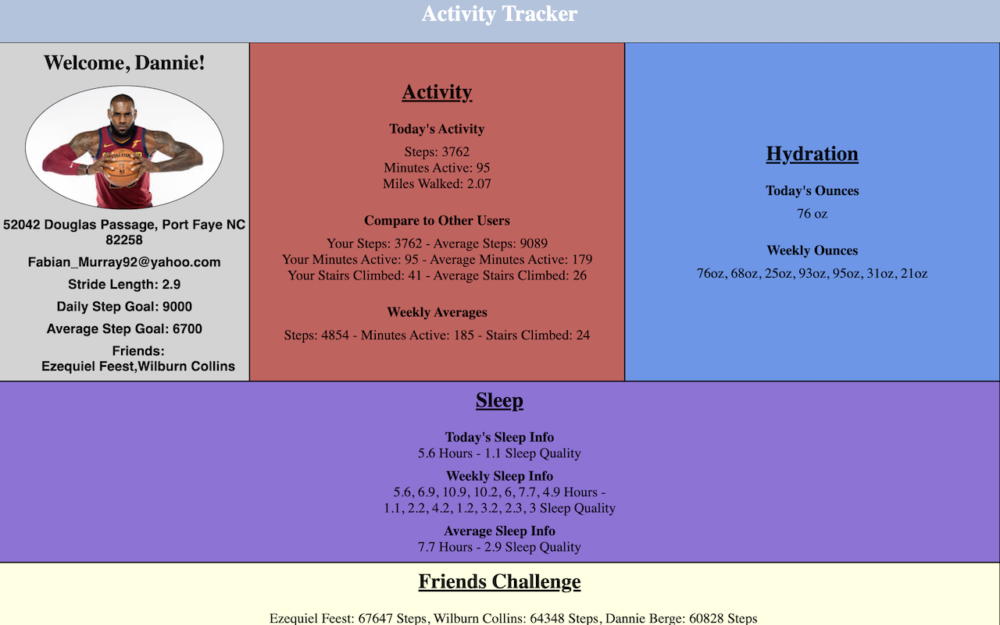

# FitLit Activity Tracker

## Contributors

Kyle Jones, https://github.com/KJJones13

Stacy Potten, https://github.com/stacyp2006

## Setup

- Once you have cloned the repo, change into the directory and install the project dependencies. Run `npm install` to install project dependencies.
- Run `open src/index.html` in the terminal to see the HTML page.
- Run `npm test` to open the testing suite.  

## Project Description

The intention of this project was for students to develop an app that displays information from an activity tracker so that a user can view their data. Data relating to user information and stats around activity, hydration, and sleep was provided in the project spec. We used test driven development to create a testing suite with both happy and sad path testing. We used these tests to guide our development. The Mocha framework and the Chai library were used to implement the testing. Technologies used included JavaScript, HTML, and CSS.

## Screenshot

